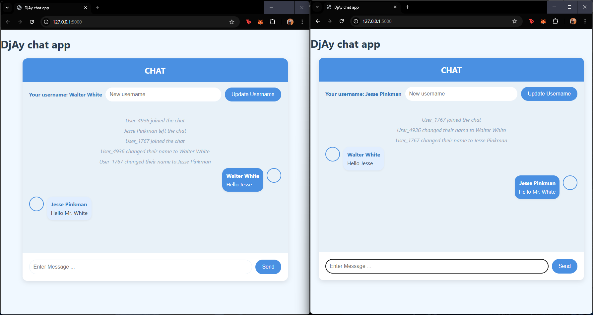

# DjAy Chat App 💬

A **real-time chat application** built using **Flask** and **Flask-SocketIO**.  
Users can join instantly, chat in real time, update their usernames, and get auto-generated avatars.

---

## 🚀 Features

- 🔴 Real-time messaging using WebSockets
- 👤 Auto-generated usernames for new users
- ✏️ Update username anytime
- 🖼 Random avatar generation (boy / girl)
- 📢 User join & leave notifications
- 👥 Broadcast messages to all connected users
- 💻 Works in multiple browser tabs/windows

---

## 🛠 Tech Stack

- **Backend:** Flask (Python)
- **Realtime:** Flask-SocketIO
- **Frontend:** HTML, CSS, JavaScript
- **Avatars API:** https://avatar.iran.liara.run

---

## 📸 Screenshot

